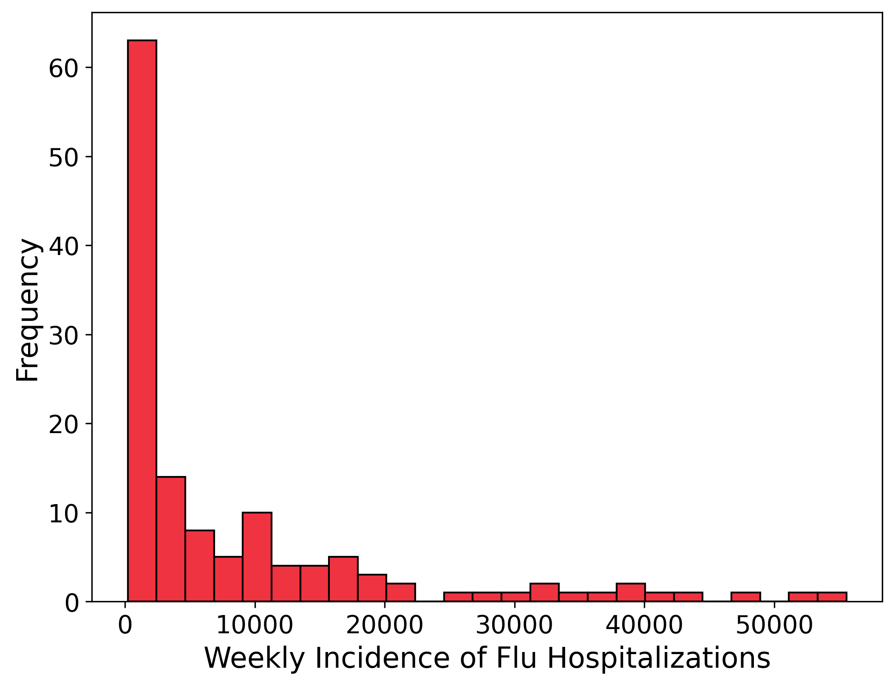
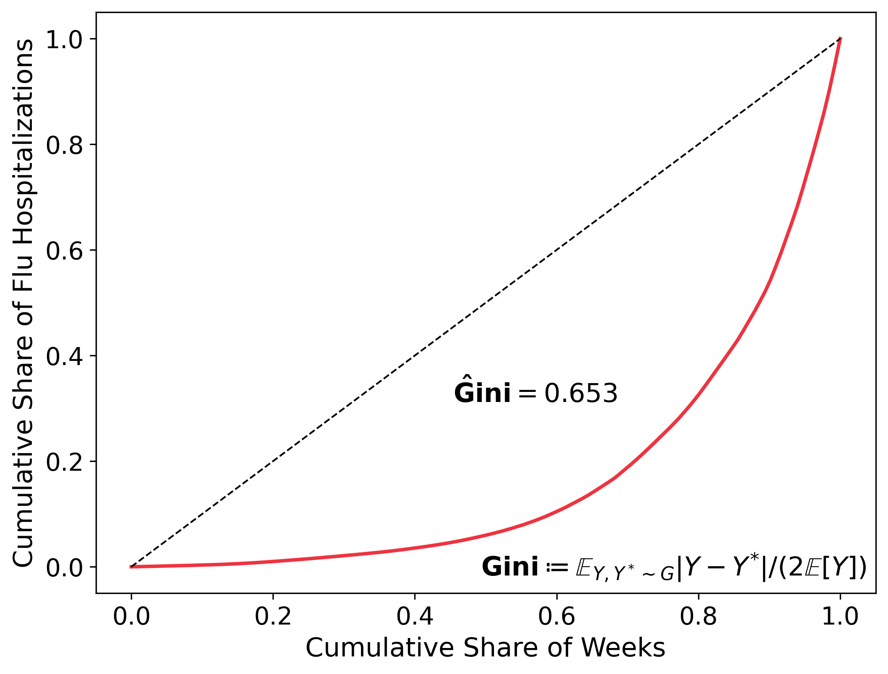
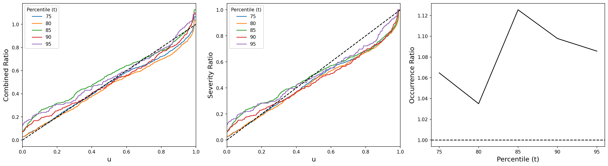

# Tail Calibration

This library contains an implementation of the Tail Calibration procedure proposed in [Allen et al. (2025)](https://www.tandfonline.com/doi/full/10.1080/01621459.2025.2506194), *Tail Calibration of Probabilistic Forecasts, Journal of the American Statistical Association (2025)*. Please consult Sam Allen's (primary author of paper) [R implementation](https://github.com/sallen12/TailCalibration). I unfortunately had not come across this repository until after I had completed the implementation presented here.

 
 A presentation I compiled on the topic can be found [here]() along with [my personal notes]() with some additional derivations. 

In its current iteration, this library is built with an application on the FluSight [2023-24](https://www.cdc.gov/flu-forecasting/evaluation/2023-2024-report.html) and [2024-25](https://www.cdc.gov/flu-forecasting/evaluation/2024-2025-report.html) data in mind. A future update would provide a more general purpose library.

If you are short on time, here are the $\textcolor{red}{\text{main takeaways of the paper}}$:
- In many forecasting environments, **extreme events exercise an outsized effect on aggregate outcomes**. Some fields include, but are not limited to, meteorology, seismology, finance, and epidemiology. It is thus of great interest to train models capable of predicting such extreme events.
-  It turns out that the usual way we evaluate probabilistic forecasts, via [scoring rules](https://en.wikipedia.org/wiki/Scoring_rule), are unable to differentiate tail behavior. 
   -  A key result from [Brehmer and Strockorb (2019)](https://projecteuclid.org/journals/electronic-journal-of-statistics/volume-13/issue-2/Why-scoring-functions-cannot-assess-tail-properties/10.1214/19-EJS1622.pdf): proper scoring rules (even weighted ones) are **not** tail aware. That is, even if the expected score of a forecast is arbitrarily close to the expected score of the true distribution, their tail behavior can differ meaningfully.
- Again, this is problematic as it implies that **training forecasters to optimize proper scores is **not** sufficient to be calibrated to the prediction of extreme events**.
- [Allen et al. (2025)](https://www.tandfonline.com/doi/full/10.1080/01621459.2025.2506194) introduce a ‘tail calibration’ framework that combines classical notions of calibration with tools from extreme value theory to circumvent the use of scoring rules and produce useful diagnostics to assess the calibration of forecasts in predicting extreme events.

As a member of [Delphi](https://delphi.cmu.edu), the natural application of this repository is on infectious disease forecasting. Specifically, weekly influenza hospitalization counts during the 2023-24 and 2024-25 seasons. 


## Motivation
Epidemiology provides a rich application area to assess tail calibration of forecasting models. 


|  |  |
|:-----------------------------------:|:-----------------------------:|

<sub> **Figure**: Histogram (left) and Lorenz curve (right) of the weekly incidence of flu hospitalization from September 2023 to March 2026 in the US. </sub>

This reveals that infectious disease presents another environment that can be characterized as both *right-tailed* with *concentration*. The estimated Gini coefficient that the average difference in the weekly incidence of flu hospitalizations is over *1.3 times greater* than the average weekly incidence of flu hospitalizations overall.  

How well is the FluSight ensemble calibrated to predicting tail events? It turns out that the model appears to be tail *probabilistically* calibrated when focusing on the 2023-24 and 2024-25 seasons. 

|  |
|:---:|

<sub>**Figure**: Combined (L), severity ratio (M), and occurrence ratio (R) of FluSight ensemble model for the 2023-24 and 2024-25 season with respect to the weekly incidence of flu hospitalizations, aggregated across all states.</sub> 

---

## Folder Structure

```
tail-calibration/
├── src/
│   └── tail_calibration/
│       ├── metrics.py          # Core tail calibration metrics and evaluation functions
│       ├── plot_utils.py       # Plotting utilities for tail calibration diagnostics
│       ├── flucast_utils.py    # FluSight data loading, filtering, and preprocessing
│       └── types.py            # Shared type aliases
├── exhibit_code/
│   ├── flu_coverage_bar_graph.py
│   ├── histogram_and_lorenz_graph.py
│   └── mortgage_default_coverage_graph.py
├── examples/
│   └── tail_calibration.ipynb  # End-to-end implementation notebook
├── images/                     # Generated figures
├── pyproject.toml
└── README.md
```

---

## Installation

**With [uv](https://github.com/astral-sh/uv) (recommended):**

```bash
uv sync
```

**With pip and requirements.txt:**

```bash
pip install -r requirements.txt
```

---

## Examples

The notebook [`examples/tail_calibration.ipynb`](examples/tail_calibration.ipynb) contains a full end-to-end walkthrough, including data loading, computing tail calibration metrics, and generating all diagnostic plots.

---

## Future Refinements

- Confidence bands for the tail calibration curve via bootstrap resampling and formal hypothesis tests for tail calibration (e.g. KS test on excess PIT values).
- Additional scoring metrics beyond WIS to evaluate on.
- Expanded plotting utilities for multi-model and multi-season comparisons. 
- Adding utility functions that are more general purpose (e.g., a compute CDF that doesn't assume an empirical quantile forecast), along with a general repurpose of the `plot_utils` and `flucast_utils` modules.
